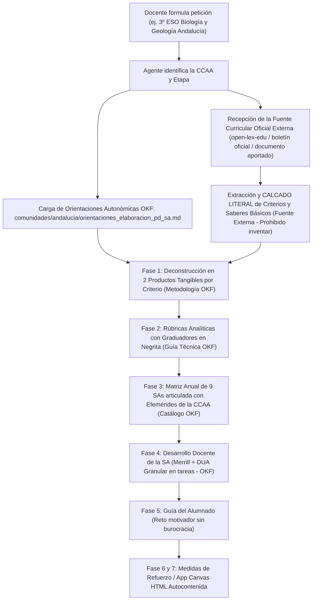

# 🏛️ Arquitectura del Open Knowledge Framework (OKF) en OpenDidactia

El **Open Knowledge Framework (OKF)** es una especificación estructurada, abierta y modular concebida para organizar el ecosistema pedagógico, metodológico y operativo del sistema educativo español. Su propósito es guiar tanto a docentes y equipos directivos como a **Sistemas RAG (Retrieval-Augmented Generation)** y **Agentes Autónomos de Inteligencia Artificial** en el diseño riguroso de Programaciones Didácticas (PD) y Situaciones de Aprendizaje (SA/UT).

---

## 1. Propósito y Separación Estricta de Responsabilidades (Modelo Dual)

Tradicionalmente, las normativas y currículos educativos se publican en extensos boletines oficiales (BOE, BOJA, BOCM, DOGC, BOC, etc.) en formatos PDF no estructurados. 

Para garantizar un funcionamiento determinista de los Agentes de IA y evitar alucinaciones o confusiones metodológicas, el estándar **OKF** establece una **separación tajante entre el marco normativo curricular y el marco metodológico operativo**:

```text
┌────────────────────────────────────────────────────────────────────────────────────────┐
│                        ARQUITECTURA DEL ESTÁNDAR OKF EN EDUCACIÓN                      │
├─────────────────────────────────────────┬──────────────────────────────────────────────┤
│    nmarafo/open-lex-edu                 │    nmarafo/OpenDidactia                      │
│    (Pilar Jurídico y Curricular Externo)│    (Pilar Pedagógico y Operativo: OKF)       │
├─────────────────────────────────────────┼──────────────────────────────────────────────┤
│ • Suministrado de forma EXTERNA         │ • Guías metodológicas y de diseño instruccional│
│ • 696 disposiciones normativas auditadas│ • Protocolo de 9 Fases (Régimen General y FP)│
│ • Textos íntegros de los 52 decretos y  │ • Orientaciones territoriales y de evaluación│
│   órdenes curriculares de las 17 CCAA   │ • Catálogos de metodologías activas y DUA    │
│ • Anexos con Saberes Básicos, Criterios │ • Efemérides escolares por CCAA y sectorial  │
│   y Competencias Específicas oficiales  │ • Esquemas JSON de validación de PD y SA/UT  │
│ • Fuente donde CALCAR elementos literales│ • Plantillas operativas y prompts modulares  │
└─────────────────────────────────────────┴──────────────────────────────────────────────┘
```

1. **El Currículo Normativo se Suministra de Forma Externa:**
   Los textos legales íntegros, decretos curriculares autonómicos y órdenes ministeriales no residen dentro del OKF operativo, sino que se proporcionan externamente (a través del repositorio hermano [**open-lex-edu**](https://github.com/nmarafo/open-lex-edu), los boletines oficiales correspondientes o la documentación adjunta por el usuario). De esta fuente externa es **de donde se obtienen y calcan obligatoriamente los elementos curriculares oficiales (competencias específicas, criterios de evaluación, saberes básicos, descriptores operativos, RAs y CEs)** sin que deban ser inventados, alterados ni parafraseados.

2. **OpenDidactia (Ecosistema Metodológico y Operativo OKF):**
   Contiene exclusivamente la base de conocimiento pedagógico, guías de diseño instruccional (David Merrill, DUA granular en tareas, rúbricas analíticas con graduadores cualitativos), plantillas adaptadas, bancos de efemérides, catálogos metodológicos y los esquemas JSON de validación. El agente acude al OKF para saber **cómo estructurar, graduar, secuenciar y metodologizar**, pero nunca para inventar el currículo.

---

## 2. Taxonomía Integral del Repositorio OpenDidactia

```text
OpenDidactia/
├── README.md                            # Guía maestra, protocolo de 9 fases y prompt maestro
├── LICENSE.md                           # Licencia CC BY-SA 4.0 y cláusula de atribución
├── .gitignore
├── schema/                              # Esquemas formales de validación (JSON Schema)
│   ├── esquema_programacion_didactica.json # Validación de PDs anuales (9 SAs)
│   ├── esquema_situacion_aprendizaje.json  # Validación de SDAs (Merrill + DUA granular)
│   ├── esquema_programacion_modulo_fp.json # Validación de Programaciones de FP (RD 659/2023)
│   └── esquema_unidad_trabajo_fp.json   # Validación de UTs/SAs competenciales en FP
├── docs/                                # Base metodológica, teórica y bancos de conocimiento
│   ├── flujo_agente_elaboracion_pd_sa.md   # Protocolo maestro de 9 fases para Agentes de IA
│   ├── catalogo_rutinas_pensamiento_y_dinamicas_grupo.md # Pensamiento visible y cooperativo
│   ├── catalogo_metodologias_aprendizaje.md # Metodologías activas (ABP, ApS, Design Thinking...)
│   ├── catalogo_efemerides_calendario_escolar_ccaa.md # Efemérides escolares 17 CCAA y FP
│   ├── guia_elaboracion_programaciones_y_ut_fp.md # Guía oficial para Formación Profesional
│   ├── banco_objetivos_planes_y_programas_ccaa.md # Objetivos, Planes y Redes por CCAA y FP
│   ├── guia_elaboracion_rubricas_graduadores.md # Rúbricas analíticas con graduadores
│   ├── guia_operacionalizacion_dua.md      # Operacionalización granular del DUA en sesiones
│   ├── ecosistema_herramientas_activas.md  # Merrill, cooperativo, rutinas y efemérides
│   ├── guia_planes_apoyo_y_recuperacion.md # Medidas de refuerzo y recuperación
│   ├── arquitectura_okf.md                 # Este documento de especificación
│   ├── taxonomia_curricular_lomloe.md      # Grafo curricular y relaciones competenciales
│   ├── guia_situaciones_aprendizaje.md     # Fundamentos pedagógicos de las SDAs
│   └── guia_programaciones_didacticas.md   # Fundamentos de la planificación anual
├── plantillas/                          # Plantillas operativas y biblioteca de prompts
│   ├── plantilla_situacion_aprendizaje.md  # Plantilla enriquecida para SDAs
│   ├── plantilla_programacion_didactica.md # Plantilla enriquecida para PDs
│   ├── plantilla_programacion_modulo_fp.md # Plantilla oficial de Módulo de FP
│   ├── plantilla_unidad_trabajo_sa_fp.md   # Plantilla oficial de UT/SA en FP
│   └── prompts/                         # Prompts del sistema modulares para IA
│       ├── prompt_maestro_arranque_agente.md # Prompt maestro unificado (< 10.000 caracteres)
│       ├── prompt_01_deconstruccion_criterios.md
│       ├── prompt_02_elaboracion_rubricas_graduadores.md
│       ├── prompt_03_secuenciacion_programacion_anual.md
│       ├── prompt_04_desarrollo_sa_docente_merrill_dua.md
│       ├── prompt_05_sa_para_alumnado.md
│       ├── prompt_06_plan_apoyo_refuerzo_individualizado.md
│       ├── prompt_07_plan_recuperacion_pendientes.md
│       ├── prompt_08_herramienta_calificacion_canvas.md
│       ├── prompt_fp_01_relacion_ra_ce_productos.md
│       ├── prompt_fp_02_rubricas_tecnicas_graduadores.md
│       └── prompt_fp_03_secuenciacion_ut_modulo.md
└── comunidades/                         # Implementación territorial y singularidades (17 CCAA + Ceuta y Melilla)
    ├── andalucia/, aragon/, asturias/, baleares/, canarias/, cantabria/, castilla_la_mancha/,
    ├── castilla_y_leon/, catalunya/, ceuta_y_melilla/, comunitat_valenciana/, extremadura/,
    ├── galicia/, la_rioja/, madrid/, murcia/, navarra/, pais_vasco/
    │   ├── README.md                    # Identificación del marco de referencia, contexto cultural y lingüístico
    │   ├── orientaciones_elaboracion_pd_sa.md # Guía metodológica autonómica (evaluación, ponderación, DUA)
    │   ├── plantilla_programacion_didactica.md # Plantilla de PD anual adaptada a la CCAA
    │   └── plantilla_situacion_aprendizaje.md # Plantilla de SDA adaptada a la CCAA
    └── canarias/
        ├── guias_oficiales/             # Documentos técnicos oficiales en PDF (instrucciones, DUA, rúbricas)
        └── ejemplos/                    # Modelos de referencia didáctica
```

---

## 3. Suministro Externo del Currículo y Prevención de Confusiones

Un principio vertebral de la arquitectura OKF es que **el agente nunca debe confundir el OKF con el currículo oficial**:

* **El OKF NO contiene normativas ni decretos curriculares:** No almacena transcripciones de leyes, decretos u órdenes, ni listados de criterios o saberes que puedan inducir al modelo a creer que el corpus normativo está cerrado o contenido en el framework.
* **El Currículo se Proporciona Externamente:** El usuario o el entorno RAG proporciona el texto curricular del área, materia o módulo correspondiente (mediante el corpus de `open-lex-edu`, boletines oficiales o documentos curriculares específicos).
* **Calco Literal sin Invenciones:** Es en esa fuente externa donde se localizan los elementos curriculares oficiales:
  - **Competencias Específicas** de la materia o área.
  - **Criterios de Evaluación** oficiales con sus redacciones textuales exactas.
  - **Saberes Básicos** y sus códigos de bloque oficial.
  - **Descriptores Operativos** del Perfil de Salida (o Competencias Clave en Infantil).
  - En FP: **Resultados de Aprendizaje (RA)**, **Criterios de Evaluación (CE)** y **Contenidos Básicos**.
  El agente tiene la orden tajante de **calcar literalmente** estos elementos de la fuente externa y jamás inventarlos ni parafrasearlos.

---

## 4. Consumo del Estándar OKF por Agentes de IA y Sistemas RAG

Cuando un Agente de Inteligencia Artificial (o un docente mediante el Prompt Maestro) genera una Programación Didáctica o Situación de Aprendizaje para cualquier territorio del Estado:



### Reglas de Oro del Estándar OKF para el Agente:
1. **Calco Literal del Currículo Externo:** Prohibido inventar, deducir o parafrasear criterios de evaluación, competencias específicas o códigos de saberes básicos. Se calcan con exactitud milimétrica a partir del currículo oficial proporcionado externamente.
2. **Aplicación Rigurosa del Marco Pedagógico OKF:** Utilizar las instrucciones, guías (`docs/`), plantillas (`plantillas/`) y orientaciones autonómicas (`comunidades/<ccaa>/`) para estructurar la programación y las situaciones de aprendizaje.
3. **Trazabilidad Ontológica:** Mantener la cadena ininterrumpida `Currículo Externo -> Criterio/CE -> Descriptor/RA -> Producto Evaluador -> Rúbrica Analítica -> Sesión de Aula con DUA`.
4. **Validación Formal:** Los documentos generados deben respetar rigurosamente los esquemas JSON de validación (`schema/`).
