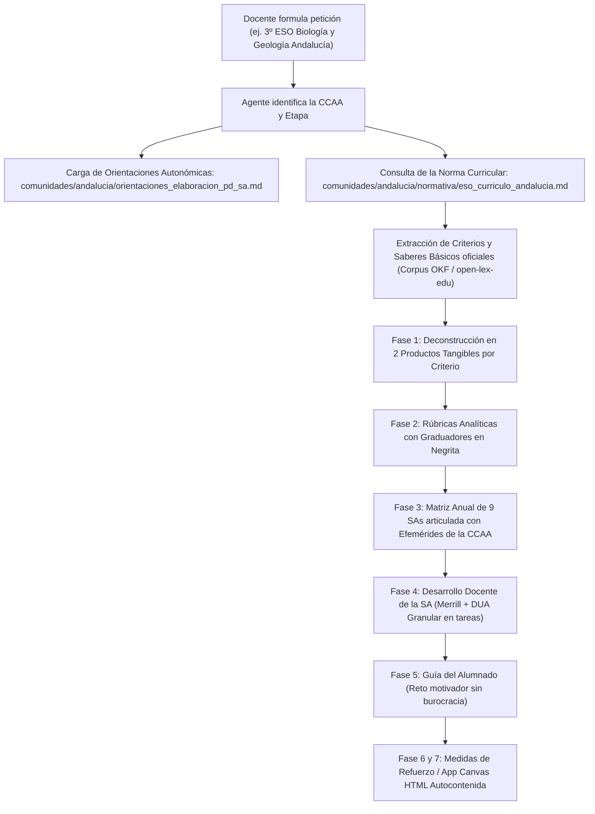

# 🏛️ Arquitectura del Open Knowledge Framework (OKF) en OpenDidactia

El **Open Knowledge Framework (OKF)** es una especificación estructurada, abierta y modular diseñada para organizar el corpus jurídico, curricular y metodológico del sistema educativo español. Está concebida tanto para la consulta directa de docentes y equipos directivos como para su ingestión determinista por **Sistemas RAG (Retrieval-Augmented Generation)** y **Agentes Autónomos de Inteligencia Artificial**.

---

## 1. Propósito y Modelo de Doble Pilar (Dual-Pillar Architecture)

Tradicionalmente, las normativas y currículos educativos se publican en extensos boletines oficiales (BOE, BOJA, BOCM, DOGC, BOC, etc.) en formatos PDF no estructurados, lo que dificulta la extracción semántica de competencias, la trazabilidad criterial y la automatización didáctica.

El estándar **OKF** resuelve esta fragmentación mediante una **arquitectura sinérgica de dos repositorios interconectados**:

```text
┌────────────────────────────────────────────────────────────────────────────────────────┐
│                        ARQUITECTURA DEL ESTÁNDAR OKF EN EDUCACIÓN                      │
├─────────────────────────────────────────┬──────────────────────────────────────────────┤
│    nmarafo/open-lex-edu                 │    nmarafo/OpenDidactia                      │
│    (Pilar Jurídico y Normativo)         │    (Pilar Pedagógico y Operativo)            │
├─────────────────────────────────────────┼──────────────────────────────────────────────┤
│ • 696 disposiciones normativas auditadas│ • Cobertura de las 17 CCAA y Ceuta/Melilla   │
│ • Textos íntegros de los 52 decretos y  │ • Protocolo de 9 Fases (Régimen General y FP)│
│   órdenes curriculares de las 17 CCAA   │ • Orientaciones autonómicas y evaluación     │
│ • Anexos con Saberes Básicos, Criterios │ • Catálogos de metodologías activas y DUA    │
│   y Competencias Específicas oficiales  │ • Efemérides escolares por CCAA y sectorial  │
│ • Metadatos YAML (schema/norm_schema)   │ • Esquemas JSON de validación curricular     │
└─────────────────────────────────────────┴──────────────────────────────────────────────┘
```

1. **open-lex-edu (Corpus Normativo y Curricular Íntegro):**
   Contiene el texto legal completo y consolidado de los Decretos y Órdenes de ordenación y currículo de todas las etapas (Infantil, Primaria, ESO, Bachillerato y Formación Profesional) para el Estado y las 17 Comunidades Autónomas. En este repositorio residen los **currículos oficiales literales**, estructurados en Markdown limpio y etiquetados con metadatos YAML conformes a `schema/norm_schema.json`.

2. **OpenDidactia (Ecosistema Metodológico y de Aplicación Didáctica):**
   Organiza territorialmente la aplicación de dichos currículos en el aula. Proporciona la metodología de diseño instruccional (Merrill, DUA granular, rúbricas analíticas con graduadores), las plantillas operativas oficiales por comunidad autónoma, los catálogos pedagógicos y el protocolo para que los Agentes de IA generen Programaciones Didácticas (PD) y Situaciones de Aprendizaje (SA) o Unidades de Trabajo (UT en FP) con trazabilidad legal absoluta.

---

## 2. Taxonomía Integral del Repositorio OpenDidactia

```text
OpenDidactia/
├── README.md                            # Guía maestra, cobertura nacional, protocolo de 9 fases y prompt maestro
├── LICENSE.md                           # Licencia CC BY-SA 4.0 y cláusula de atribución
├── .gitignore
├── schema/                              # Esquemas formales de validación (JSON Schema)
│   ├── norm_schema.json                 # Esquema OKF de disposiciones normativas (open-lex-edu)
│   ├── esquema_programacion_didactica.json # Validación de PDs anuales (9 SAs)
│   ├── esquema_situacion_aprendizaje.json  # Validación de SDAs (Merrill + DUA granular)
│   ├── esquema_programacion_modulo_fp.json # Validación de Programaciones de FP (RD 659/2023)
│   └── esquema_unidad_trabajo_fp.json   # Validación de UTs/SAs competenciales en FP
├── docs/                                # Base metodológica, teórica y bancos de conocimiento
│   ├── flujo_agente_elaboracion_pd_sa.md   # Protocolo maestro de 9 fases para Agentes de IA
│   ├── catalogo_rutinas_pensamiento_y_dinamicas_grupo.md # Pensamiento visible y cooperativo
│   ├── catalogo_metodologias_aprendizaje.md # Metodologías activas (ABP, ApS, Design Thinking...)
│   ├── catalogo_efemerides_calendario_escolar_ccaa.md # Efemérides escolares 17 CCAA y FP
│   ├── guia_elaboracion_programaciones_y_ut_fp.md # Guía oficial para Formación Profesional
│   ├── banco_objetivos_planes_y_programas_ccaa.md # Objetivos, Planes y Redes por CCAA y FP
│   ├── guia_elaboracion_rubricas_graduadores.md # Rúbricas analíticas con graduadores
│   ├── guia_operacionalizacion_dua.md      # Operacionalización granular del DUA en sesiones
│   ├── ecosistema_herramientas_activas.md  # Merrill, cooperativo, rutinas y efemérides
│   ├── guia_planes_apoyo_y_recuperacion.md # Medidas de refuerzo y recuperación
│   ├── arquitectura_okf.md                 # Este documento de especificación
│   ├── taxonomia_curricular_lomloe.md      # Grafo curricular y relaciones competenciales
│   ├── guia_situaciones_aprendizaje.md     # Fundamentos pedagógicos de las SDAs
│   └── guia_programaciones_didacticas.md   # Fundamentos de la planificación anual
├── plantillas/                          # Plantillas operativas y biblioteca de prompts
│   ├── plantilla_situacion_aprendizaje.md  # Plantilla enriquecida para SDAs
│   ├── plantilla_programacion_didactica.md # Plantilla enriquecida para PDs
│   ├── plantilla_programacion_modulo_fp.md # Plantilla oficial de Módulo de FP
│   ├── plantilla_unidad_trabajo_sa_fp.md   # Plantilla oficial de UT/SA en FP
│   └── prompts/                         # Prompts del sistema modulares para IA
│       ├── prompt_maestro_arranque_agente.md # Prompt maestro unificado (< 10.000 caracteres)
│       ├── prompt_01_deconstruccion_criterios.md
│       ├── prompt_02_elaboracion_rubricas_graduadores.md
│       ├── prompt_03_secuenciacion_programacion_anual.md
│       ├── prompt_04_desarrollo_sa_docente_merrill_dua.md
│       ├── prompt_05_sa_para_alumnado.md
│       ├── prompt_06_plan_apoyo_refuerzo_individualizado.md
│       ├── prompt_07_plan_recuperacion_pendientes.md
│       ├── prompt_08_herramienta_calificacion_canvas.md
│       ├── prompt_fp_01_relacion_ra_ce_productos.md
│       ├── prompt_fp_02_rubricas_tecnicas_graduadores.md
│       └── prompt_fp_03_secuenciacion_ut_modulo.md
└── comunidades/                         # Implementación territorial por CCAA (17 CCAA + Ceuta y Melilla)
    ├── andalucia/                       # Cada carpeta autonómica cuenta con:
    ├── aragon/                          # ├── orientaciones_elaboracion_pd_sa.md (Ponderación, CCAA, DUA)
    ├── asturias/                        # ├── plantilla_programacion_didactica.md (Adaptada a la CCAA)
    ├── baleares/                        # ├── plantilla_situacion_aprendizaje.md (Adaptada a la CCAA)
    ├── canarias/                        # ├── normativa/ (Disposiciones oficiales con metadatos OKF)
    ├── cantabria/                       # └── curricular/ (Espacios por etapa: infantil, primaria,
    ├── castilla_la_mancha/              #                  eso, bachillerato y fp)
    ├── castilla_y_leon/
    ├── catalunya/
    ├── ceuta_y_melilla/
    ├── comunitat_valenciana/
    ├── extremadura/
    ├── galicia/
    ├── la_rioja/
    ├── madrid/
    ├── murcia/
    ├── navarra/
    └── pais_vasco/
```

---

## 3. Inclusión y Acceso a los Currículos de las CCAA en el OKF

Los currículos de las distintas Comunidades Autónomas están **plenamente integrados** en el ecosistema OKF mediante dos niveles de acceso complementarios:

### Nivel A: Fichas de Referencia y Orientaciones Autonómicas (en `OpenDidactia`)
* Cada carpeta `comunidades/<ccaa>/normativa/` contiene las fichas normalizadas en Markdown de los Decretos y Órdenes de currículo vigentes en esa comunidad autónoma (Infantil, Primaria, ESO, Bachillerato y FP).
* Cada ficha incluye metadatos formales estructurados (ID de norma, boletín oficial de publicación, fecha, categoría canónica `03_ordenacion_curricular_y_ensenanzas`, estado vigente y enlace a la fuente oficial).
* En `comunidades/<ccaa>/orientaciones_elaboracion_pd_sa.md` se compilan las singularidades normativas de cada territorio:
  * Modelo de calificación oficial (numérico 1-10 en Primaria/ESO/BAC o cualitativo en Infantil; consecución de RA en FP).
  * Directrices sobre ponderación criterial y deconstrucción.
  * Hitos conmemorativos del calendario escolar autonómico (Sección 2.3).
  * Programas y redes de innovación educativa institucionales.

### Nivel B: Textos Curriculares Íntegros (en `open-lex-edu`)
* En el repositorio complementario [**nmarafo/open-lex-edu**](https://github.com/nmarafo/open-lex-edu) se alojan los textos íntegros y anexos curriculares de las 52 normas autonómicas.
* Los anexos contienen el desglose oficial exhaustivo de:
  * **Competencias Específicas** de cada área o materia.
  * **Criterios de Evaluación** oficiales con sus redacciones textuales exactas.
  * **Saberes Básicos** organizados por bloques temáticos y códigos normativos.
  * **Descriptores Operativos** del Perfil de Salida adaptados por la comunidad.

---

## 4. Consumo del Estándar OKF por Agentes de IA y Sistemas RAG

Cuando un Agente de Inteligencia Artificial (o un docente mediante el Prompt Maestro) genera una Programación Didáctica o Situación de Aprendizaje para cualquier territorio del Estado:



### Reglas de Oro del Estándar OKF para el Agente:
1. **Fidelidad Legal Absoluta:** Prohibido inventar o parafrasear criterios de evaluación, competencias específicas o códigos de saberes básicos. Se citan fielmente según el decreto de la comunidad autónoma elegida.
2. **Trazabilidad Ontológica:** Mantener la cadena ininterrumpida `Norma Autonómica -> Criterio/CE -> Descriptor/RA -> Producto Evaluador -> Rúbrica Analítica -> Sesión de Aula con DUA`.
3. **Validación Formal:** Los documentos generados se estructuran de forma congruente con los esquemas JSON del repositorio (`schema/`).
