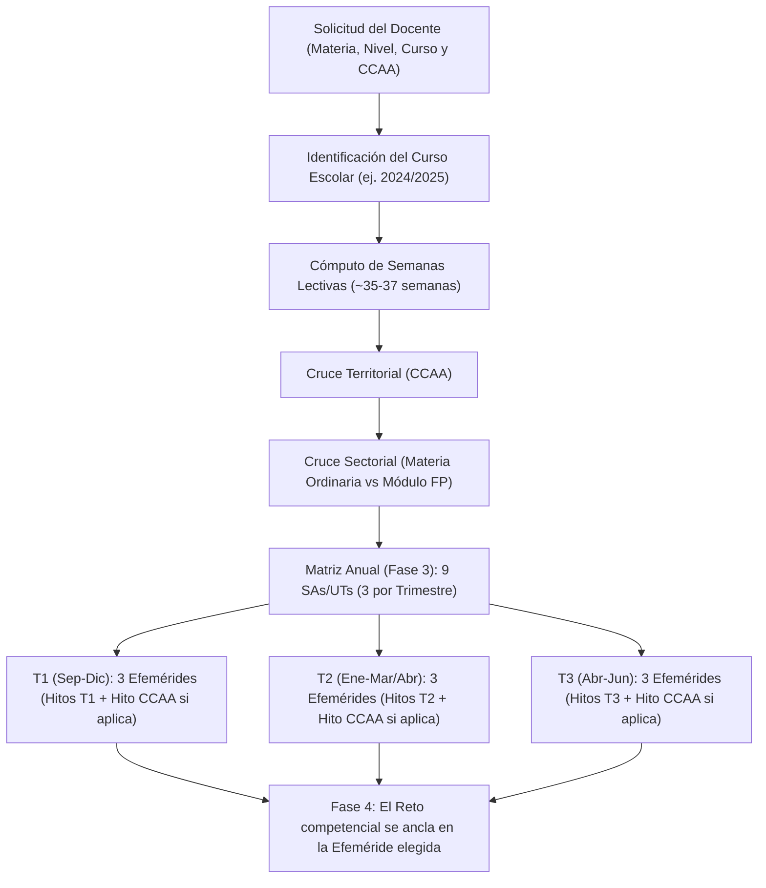

# 📅 Catálogo de Efemérides del Calendario Escolar, Hitos Autonómicos y Calendario Sectorial FP

Este documento constituye la **guía de referencia oficial de OpenDidactia** para la articulación temporal y contextual de las **9 Situaciones de Aprendizaje (SAs) o Unidades de Trabajo (UTs)** a lo largo del curso escolar.

El objetivo es proporcionar al docente y al agente de Inteligencia Artificial un catálogo estructurado para que cada Situación de Aprendizaje o Unidad de Trabajo cuente con un **anclaje en la realidad del entorno**, vinculándose con fechas conmemorativas de carácter internacional, nacional, autonómico o sectorial.

---

## 🎯 1. Principios Pedagógicos de Integración de Efemérides

La LOMLOE y la normativa de Formación Profesional (Ley Orgánica 3/2022 y Real Decreto 659/2023) exigen que el aprendizaje sea **significativo, competencial, contextualizado y transferible**. La inclusión de efemérides en la matriz anual no es un fin en sí mismo ni una actividad decorativa aislada, sino una palanca pedagógica:

1. **Detonante Motivador del Reto:** La efeméride sirve como justificación de partida o acontecimiento dinamizador para plantear el desafío o problema de la SA/UT (ej. celebrar la *Semana Europea de la Movilidad* investigando el transporte en el municipio).
2. **Conexión Interdisciplinar y ODS:** Facilita la articulación de retos vinculados con los Objetivos de Desarrollo Sostenible (Agenda 2030), la igualdad de género, la inclusión, la cultura de paz, la memoria democrática y la sostenibilidad ecosocial.
3. **Identidad Cultural y Sentido de Pertenencia:** Conecta con las tradiciones, historia, patrimonio natural y lingüístico de la Comunidad Autónoma correspondiente.
4. **Vinculación con el Tejido Productivo (FP):** En Formación Profesional, los hitos del calendario sectorial (ferias industriales, días mundiales de la ciberseguridad, salud laboral, logística, etc.) aproximan al alumnado al entorno laboral real y a la alternancia formativa en empresa.

---

## 🗓️ 2. Calendario General de Efemérides Escolares (Nacionales e Internacionales)

Distribuido a lo largo de las **35 a 37 semanas lectivas** del año escolar en los tres trimestres ordinarios:

### 🍂 Primer Trimestre (Septiembre - Diciembre)

| Mes | Fecha / Periodo | Efeméride o Hito Escolar | Oportunidad Didáctica y Conexión Competencial |
| :--- | :--- | :--- | :--- |
| **Septiembre** | Inicio de curso | **Acogida y Cohesión Grupal** | Dinámicas de conocimiento, acuerdos de aula, evaluación diagnóstica inicial. |
| **Septiembre** | 16 al 22 de sep. | **Semana Europea de la Movilidad** | Sostenibilidad, huella de carbono, movilidad activa y diseño de ciudades habitables. |
| **Septiembre** | 21 de septiembre | **Día Internacional de la Paz** | Convivencia, resolución pacífica de conflictos, empatía y derechos fundamentales. |
| **Septiembre** | 26 de septiembre | **Día Europeo de las Lenguas** | Plurilingüismo, diversidad lingüística, intercambio cultural y patrimonio inmaterial. |
| **Octubre** | 1.ᵉʳ lunes de oct. | **Día de la Educación Financiera** | Consumo responsable, presupuesto familiar, economía sostenible y finanzas éticas. |
| **Octubre** | 5 de octubre | **Día Mundial de los Docentes** | Reconocimiento a la educación como derecho humano universal y motor de transformación. |
| **Octubre** | Lunes más próx. al 15 oct. | **Día de las Escritoras** | Visibilización de autoras literarias históricas y contemporáneas, plan lector e igualdad. |
| **Octubre** | 24 de octubre | **Día de las Bibliotecas Escolares** | Alfabetización informacional, búsqueda crítica de fuentes, dinamización lectora y podcast. |
| **Noviembre** | 1.ª quincena nov. | **Semana de la Ciencia y la Innovación** | Método científico, divulgación, ferias científicas escolares y vocaciones STEAM. |
| **Noviembre** | 20 de noviembre | **Día Universal de la Infancia** | Derechos de los niños y niñas, bienestar de la infancia, equidad e inclusión escolar. |
| **Noviembre** | 25 de noviembre | **Día Internacional contra la Violencia de Género (25N)** | Coeducación, prevención de violencia machista, relaciones igualitarias y buen trato. |
| **Diciembre** | 3 de diciembre | **Día Internacional de las Personas con Discapacidad** | Accesibilidad universal, empatía, inclusión real, DUA y eliminación de barreras. |
| **Diciembre** | 6 de diciembre | **Día de la Constitución Española** | Valores democráticos, derechos fundamentales, deberes cívicos e instituciones del Estado. |
| **Diciembre** | 10 de diciembre | **Día de los Derechos Humanos** | Justicia social, dignidad humana, ciudadanía global y libertades civiles. |

---

### ❄️ Segundo Trimestre (Enero - Marzo / Abril)

| Mes | Fecha / Periodo | Efeméride o Hito Escolar | Oportunidad Didáctica y Conexión Competencial |
| :--- | :--- | :--- | :--- |
| **Enero** | Inicio de enero | **Vuelta de Vacaciones y Reencuentro** | Evaluación formativa del 1.º trimestre, autorregulación y metas para el 2.º periodo. |
| **Enero** | 24 de enero | **Día Internacional de la Educación** | Derecho universal a la educación, cooperación internacional y erradicación de la pobreza. |
| **Enero** | 30 de enero | **Día Escolar de la No Violencia y la Paz (DENIP)** | Celebración universal en colegios e institutos: mediación escolar y cultura de paz. |
| **Febrero** | 2.ª semana feb. | **Día de Internet Segura (*Safer Internet Day*)** | Ciberseguridad, prevención del ciberacoso, identidad digital, privacidad e IA ética. |
| **Febrero** | 11 de febrero | **Día Internacional de la Mujer y la Niña en la Ciencia** | Referentes científicas y tecnólogas, ruptura de estereotipos de género y proyectos STEAM. |
| **Febrero** | Fecha móvil | **Carnavales Escolares** | Creatividad plástica, dramatización, expresión corporal, patrimonio festivo y folclórico. |
| **Marzo** | 8 de marzo | **Día Internacional de las Mujeres (8M)** | Igualdad laboral, corresponsabilidad, historia del movimiento feminista y coeducación. |
| **Marzo** | 14 de marzo | **Día Internacional de las Matemáticas (Día Pi - 3/14)** | Divulgación matemática, problemas de la vida cotidiana, geometría en el arte y modelado. |
| **Marzo** | 21 de marzo | **Día Mundial de la Poesía y de los Bosques** | Recitales poéticos, biodiversidad forestal, reforestación y lucha contra la desertificación. |
| **Marzo** | 22 de marzo | **Día Mundial del Agua** | Ciclo integral del agua, sequía, ahorro hídrico, cambio climático y derecho al saneamiento. |
| **Marzo/Abril** | Fecha móvil | **Semana Santa / Periodo de Descanso** | Ajuste según el calendario escolar anual específico aprobado por la Comunidad Autónoma. |

---

### ☀️ Tercer Trimestre (Abril - Junio)

| Mes | Fecha / Periodo | Efeméride o Hito Escolar | Oportunidad Didáctica y Conexión Competencial |
| :--- | :--- | :--- | :--- |
| **Abril** | 6 de abril | **Día Mundial de la Actividad Física y del Deporte** | Estilos de vida saludables, ocio activo, juego limpio y trabajo en equipo. |
| **Abril** | 7 de abril | **Día Mundial de la Salud** | Bienestar físico y mental, nutrición equilibrada, prevención sanitaria y hábitos de descanso. |
| **Abril** | 23 de abril | **Día Internacional del Libro y de los Derechos de Autor** | Ferias del libro escolar, creación literaria, fomento de la lectura y certámenes. |
| **Mayo** | 9 de mayo | **Día de Europa** | Integración europea, ciudadanía democrática, historia contemporánea y proyectos Erasmus+. |
| **Mayo** | 15 de mayo | **Día Internacional de las Familias** | Diversidad familiar, corresponsabilidad doméstica, vínculos afectivos y escuela de familias. |
| **Mayo** | 17 de mayo | **Día Mundial del Reciclaje y de Internet** | Economía circular, gestión de residuos 3R, competencia digital y soberanía tecnológica. |
| **Junio** | 5 de junio | **Día Mundial del Medio Ambiente** | Conservación de ecosistemas, transición ecológica, emergencia climática y acción comunitaria. |
| **Junio** | 8 de junio | **Día Mundial de los Océanos** | Ecosistemas marinos, contaminación por plásticos, pesca sostenible y biodiversidad acuática. |
| **Junio** | Fin de curso | **Evaluación Final, Cierre y Graduación** | Portfolios de aprendizaje, autoevaluación, cierre de proyectos y transferencia final. |

---

## 🏛️ 3. Catálogo Oficial de Efemérides e Hitos Autonómicos (17 CCAA + Ceuta y Melilla)

Cada una de las 17 Comunidades Autónomas y las Ciudades Autónomas de Ceuta y Melilla cuenta con **fechas conmemorativas oficiales** fijadas en sus calendarios escolares que deben articularse preferentemente en las Situaciones de Aprendizaje de los trimestres correspondientes:

```
┌─────────────────────────────────────────────────────────────────────────────────────────────┐
│                       HITOS CONMEMORATIVOS OFICIALES POR COMUNIDAD AUTÓNOMA                │
├────────────────────────┬─────────────────────────────┬──────────────────────────────────────┤
│ Comunidad Autónoma     │ Fechas Conmemorativas       │ Denominación y Ámbito Curricular     │
├────────────────────────┼─────────────────────────────┼──────────────────────────────────────┤
│ 1. Andalucía           │ 16 de Noviembre             │ Día del Flamenco en las Aulas        │
│                        │ 28 de Febrero               │ Día de Andalucía (Semana Cultural)   │
├────────────────────────┼─────────────────────────────┼──────────────────────────────────────┤
│ 2. Aragón              │ 23 de Abril                 │ Día de Aragón / San Jorge            │
├────────────────────────┼─────────────────────────────┼──────────────────────────────────────┤
│ 3. Asturias            │ 8 de Septiembre             │ Día de Asturias                      │
│                        │ 1.ª semana de Mayo          │ Selmana de les Lletres Asturianes    │
├────────────────────────┼─────────────────────────────┼──────────────────────────────────────┤
│ 4. Illes Balears       │ 1 de Marzo                  │ Diada de les Illes Balears           │
│                        │ 23 de Abril                 │ Diada de Sant Jordi                  │
├────────────────────────┼─────────────────────────────┼──────────────────────────────────────┤
│ 5. Canarias            │ 21 de Febrero               │ Día de las Letras Canarias           │
│                        │ 30 de Mayo                  │ Día de Canarias (Tradiciones)        │
├────────────────────────┼─────────────────────────────┼──────────────────────────────────────┤
│ 6. Cantabria           │ 15 de Septiembre            │ Festividad de La Bien Aparecida      │
│                        │ 28 de Julio                 │ Día de las Instituciones de Cantabria│
├────────────────────────┼─────────────────────────────┼──────────────────────────────────────┤
│ 7. Castilla-La Mancha  │ 31 de Mayo                  │ Día de la Región de Castilla-La Mancha│
├────────────────────────┼─────────────────────────────┼──────────────────────────────────────┤
│ 8. Castilla y León     │ 23 de Abril                 │ Día de Castilla y León / Villalar    │
├────────────────────────┼─────────────────────────────┼──────────────────────────────────────┤
│ 9. Catalunya           │ 11 de Septiembre            │ Diada Nacional de Catalunya          │
│                        │ 23 de Abril                 │ Diada de Sant Jordi (Llibre i Rosa)  │
├────────────────────────┼─────────────────────────────┼──────────────────────────────────────┤
│ 10. Comunitat Val.     │ 9 de Octubre                │ Dia de la Comunitat Valenciana       │
├────────────────────────┼─────────────────────────────┼──────────────────────────────────────┤
│ 11. Extremadura        │ 8 de Septiembre             │ Día de Extremadura                   │
├────────────────────────┼─────────────────────────────┼──────────────────────────────────────┤
│ 12. Galicia            │ 17 de Mayo                  │ Día das Letras Galegas               │
│                        │ 25 de Julio                 │ Día Nacional de Galicia              │
├────────────────────────┼─────────────────────────────┼──────────────────────────────────────┤
│ 13. Comunidad de Madrid│ 2 de Mayo                   │ Fiesta de la Comunidad de Madrid     │
├────────────────────────┼─────────────────────────────┼──────────────────────────────────────┤
│ 14. Región de Murcia   │ 9 de Junio                  │ Día de la Región de Murcia           │
├────────────────────────┼─────────────────────────────┼──────────────────────────────────────┤
│ 15. C. Foral de Navarra│ 3 de Diciembre              │ Día de Navarra / San Francisco Javier│
├────────────────────────┼─────────────────────────────┼──────────────────────────────────────┤
│ 16. País Vasco         │ 3 de Diciembre              │ Euskararen Eguna (Día del Euskera)   │
├────────────────────────┼─────────────────────────────┼──────────────────────────────────────┤
│ 17. La Rioja           │ 9 de Junio                  │ Día de La Rioja                      │
├────────────────────────┼─────────────────────────────┼──────────────────────────────────────┤
│ 18. Ceuta y Melilla    │ 2 de Septiembre             │ Día de Ceuta                         │
│                        │ 17 de Septiembre            │ Día de Melilla                       │
└────────────────────────┴─────────────────────────────┴──────────────────────────────────────┘
```

### Detalle de Aplicación Didáctica Autonómica:

1. **Andalucía:**
   - **16 de Noviembre (Día del Flamenco):** Patrimonio Inmaterial de la Humanidad. Ocasión para proyectos en Música, Lengua Castellana, Historia y Educación Plástica sobre el cante, baile, compás y literatura popular.
   - **28 de Febrero (Día de Andalucía):** Celebrado habitualmente con una *Semana de Andalucía* previa: historia autonómica, geografía andaluza, productos típicos (desayuno molinero), literatura y símbolos.
2. **Aragón:**
   - **23 de Abril (San Jorge / Día de Aragón):** Festividad identitaria que aúna el fomento de la lectura con la mitología, la historia de la Corona de Aragón y el patrimonio natural del Pirineo y el Valle del Ebro.
3. **Asturias:**
   - **8 de Septiembre (Día de Asturias):** Geografía, paisaje protegido de los Picos de Europa, folclore y tradiciones mineras y ganaderas.
   - **1.ª semana de Mayo (Selmana de les Lletres Asturianes):** Proyectos dedicados a autores en lengua asturiana (*asturianu*) o gallego-asturiano (*eonaviego*), poesía, música tradicional y tonada.
4. **Illes Balears:**
   - **1 de Marzo (Diada de les Illes Balears):** Historia insular, autogobierno, biodiversidad marina del archipiélago (praderas de posidonia) y patrimonio cultural mediterráneo.
   - **23 de Abril (Sant Jordi):** Fiestas del libro y la rosa en todos los centros escolares, certámenes literarios y proyectos de biblioteca.
5. **Canarias:**
   - **21 de Febrero (Día de las Letras Canarias):** Homenaje a autores y autoras del archipiélago designados cada año, literatura insular, identidad atlántica y riqueza léxica del dialecto canario.
   - **30 de Mayo (Día de Canarias):** Semana de las tradiciones en colegios e institutos: vulcanología insular, deportes autóctonos (lucha canaria, juego del palo), gastronomía, vestimenta tradicional y fauna endémica.
6. **Cantabria:**
   - **15 de Septiembre (La Bien Aparecida) / 28 de Julio (Día de las Instituciones):** Historia de los valles cántabros, arquitectura montañesa, arte rupestre paleolítico (Altamira) y reservas naturales del norte.
7. **Castilla-La Mancha:**
   - **31 de Mayo (Día de la Región):** Patrimonio cervantino (Ruta de Don Quijote), molinos de viento, parques nacionales (Tablas de Daimiel, Cabañeros), artesanía toledana y transición energética.
8. **Castilla y León:**
   - **23 de Abril (Día de Castilla y León / Villalar):** Movimiento de los Comuneros de Castilla, arte románico y gótico, patrimonio histórico-artístico universal, lengua castellana y reto demográfico rural.
9. **Catalunya:**
   - **11 de Septiembre (Diada Nacional de Catalunya):** Historia contemporánea, lengua e instituciones de autogobierno de Catalunya.
   - **23 de Abril (Diada de Sant Jordi):** Celebración masiva de la literatura, creación de puntos de libro, rosas de artesanía, recitales poéticos y proyectos de dinamización lectora.
10. **Comunitat Valenciana:**
    - **9 de Octubre (Dia de la Comunitat Valenciana):** Entrada de Jaume I en València, Furs de València, cultura del arroz y la huerta, música de bandas y certámenes cívicos.
11. **Extremadura:**
    - **8 de Septiembre (Día de Extremadura):** Dehesa extremeña, trashumancia, patrimonio arqueológico romano (Mérida), historia medieval y literatura popular.
12. **Galicia:**
    - **17 de Mayo (Día das Letras Galegas):** Homenaje anual de la Real Academia Galega a una figura destacada de las letras gallegas. Desarrollo de proyectos sobre narrativa, poesía, cancioneros populares y sociolingüística.
    - **25 de Julio (Día Nacional de Galicia):** Patrimonio xacobeo, el Camino de Santiago, cultura marinera, rías y cancionero tradicional.
13. **Comunidad de Madrid:**
    - **2 de Mayo (Fiesta de la Comunidad de Madrid):** Levantamiento popular de 1808, historia de la Ilustración, el Siglo de Oro en Madrid, museos del Paseo del Arte y geografía de la Sierra de Guadarrama.
14. **Región de Murcia:**
    - **9 de Junio (Día de la Región de Murcia):** Estatuto de Autonomía, la huerta murciana, gestión eficiente del agua, ecosistemas del Mar Menor y patrimonio paleontológico y arqueológico.
15. **Comunidad Foral de Navarra:**
    - **3 de Diciembre (Día de Navarra / San Francisco Javier):** Coincidente con el Día del Euskera. Historia del Reino de Navarra, fueros históricos, Pirineos navarros, Bardenas Reales y diversidad lingüística.
16. **País Vasco:**
    - **3 de Diciembre (Euskararen Nazioarteko Eguna / Día del Euskera):** Impulso y dinamización del euskera, bertsolarismo, mitología vasca, historia industrial y patrimonio marítimo cantábrico.
17. **La Rioja:**
    - **9 de Junio (Día de La Rioja):** Cuna del castellano y del euskera (Monasterios de San Millán de la Cogolla - Yuso y Suso), cultura vitivinícola, geología de los valles del Ebro y Sierra de la Demanda.
18. **Ceuta y Melilla:**
    - **2 y 17 de Septiembre (Día de Ceuta y Día de Melilla):** Convivencia intercultural de las cuatro culturas (cristiana, musulmana, hebrea e hindú), enclave estratégico en el Estrecho de Gibraltar y patrimonio militar y modernista.

---

## 🔧 4. Calendario Sectorial y de Innovación en Formación Profesional (FP)

En Formación Profesional, bajo la Ley Orgánica 3/2022 y el Real Decreto 659/2023, las Unidades de Trabajo (UTs) deben vincularse preferentemente con el **Calendario Profesional y Sectorial**:

### Hitos Sectoriales y de Innovación:

| Periodo / Mes | Hito Sectorial / Evento de FP | Conexión Didáctica en Ciclos Formativos |
| :--- | :--- | :--- |
| **Octubre / Noviembre** | **European Vocational Skills Week (Semana Europea de la FP)** | Puesta en valor de la excelencia técnica, movilidad europea Erasmus+ y proyectos internacionales de FP. |
| **Noviembre** | **SIMO Educación / Ferias de Tecnología Educativa** | Familias de Informática, Imagen y Sonido y Administración: aulas ATECA y transformación digital. |
| **30 de Noviembre** | **Día Internacional de la Seguridad de la Información** | Ciberseguridad, protección de datos (RGPD), análisis forense digital y buenas prácticas de redes. |
| **Enero / Febrero** | **Jornadas de Innovación en Aulas ATECA y Emprendimiento** | Aulas de Tecnología Aplicada (ATECA) y Aulas de Emprendimiento: prototipado rápido, impresión 3D, RV/RA y pitch de proyectos. |
| **Marzo** | **Salón AULA / Salón Internacional de la FP** | Orientación profesional y académica, acreditación de competencias y relación con tejido empresarial. |
| **Marzo / Abril** | **Campeonatos Nacionales Spainskills / Euroskills / Worldskills** | Competición técnica de destrezas profesionales en automoción, mecatrónica, desarrollo web, sanidad, cocina, soldadura, etc. |
| **28 de Abril** | **Día Mundial de la Seguridad y la Salud en el Trabajo** | Módulo de Formación y Orientación Laboral (FOL/Itinerario Personal para la Empleabilidad) e IPE: prevención de riesgos, EPIs, ergonomía y cultura preventiva. |
| **Mayo** | **Feria de Empresas Simuladas y Startups Educativas** | Creación y Gestión de Empresas, módulos de Empresa e Iniciativa Emprendedora (EIE/Digitalización aplicada a los sectores productivos). |
| **Periodo Anual** | **Fase de Formación en Empresa / FP Dual en Alternancia** | Periodos obligatorios en empresa adaptados al calendario laboral y sectorial del ciclo y curso concreto. |

---

## ⚙️ 5. Protocolo de Sincronización para el Agente de IA

Cuando el agente de OpenDidactia ejecuta la **Fase 3 (Secuenciación de la Programación Anual)** y la **Fase 4 (Desarrollo de la Situación de Aprendizaje o Unidad de Trabajo)**, debe seguir este procedimiento:



### Reglas de Ejecución del Agente:

1. **Equilibrio de Efemérides en las 9 SAs/UTs:**
   - Cada una de las 9 SAs/UTs debe contar con una efeméride o hito profesional asociado en la columna 4 de la matriz anual de Fase 3.
   - En el trimestre donde coincida el **Hito Autonómico oficial** (ej. Día de Andalucía en T2, Día das Letras Galegas en T3, Diada de la Comunitat Valenciana en T1, etc.), se asignará preferentemente a una de las tres SAs de ese trimestre.
2. **Actualización al Año Académico Concreto:**
   - El agente ajusta la posición de los hitos móviles (Carnavales y Semana Santa) en función de los meses exactos en que caigan en el curso solicitado (ej. si Semana Santa cae a finales de marzo, el T2 concluye en marzo y la SA de Semana Santa o primavera se ubica en el cierre de T2).
   - En FP, se sincroniza con el calendario de **Formación en Empresa** del curso escolar solicitado, respetando la alternancia entre centro educativo y centros de trabajo según el RD 659/2023.
3. **Coherencia con el Reto y el Producto Final:**
   - La efeméride seleccionada no debe ser un adorno artificial: debe guardar conexión pedagógica o temática con el producto final o el contexto del reto de la SA (ej. conectar una SA de genética o salud con el Día Mundial de la Salud en abril; una de energías limpias con la Semana Europea de la Movilidad en septiembre; etc.).
