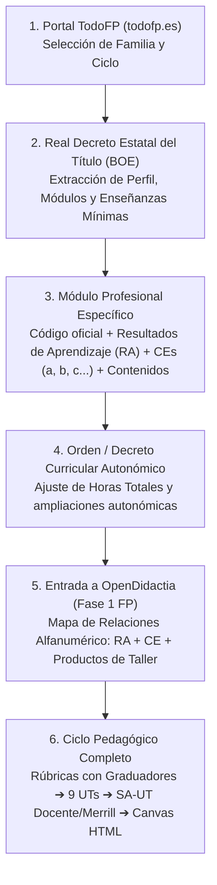

# 🛠️ Catálogo Oficial de Familias Profesionales y Títulos de FP (TodoFP - MEFPD)

> **Documento Técnico de Referencia de OpenDidactia para Formación Profesional**  
> Basado en el Catálogo Nacional de Ofertas de Formación Profesional del Ministerio de Educación, Formación Profesional y Deportes ([**TodoFP**](https://todofp.es)), la **Ley Orgánica 3/2022** (LOOIFP), el **Real Decreto 659/2023** y la normativa curricular estatal y autonómica.

---

## 1. El Marco Oficial de la FP en España y el Portal TodoFP

El portal oficial del Ministerio de Educación, Formación Profesional y Deportes [**TodoFP**](https://todofp.es) constituye la fuente primaria oficial de información sobre la oferta formativa, la estructura curricular y la ordenación de las enseñanzas de Formación Profesional en todo el territorio español.

A diferencia del Régimen General (Infantil, Primaria, ESO y Bachillerato) —donde cada Comunidad Autónoma publica un decreto único para todas las materias de la etapa—, en Formación Profesional:
1. **Cada título profesional cuenta con un Real Decreto específico** publicado en el Boletín Oficial del Estado (BOE), el cual define el perfil profesional, las competencias profesionales, personales y sociales (CPPS), los módulos profesionales que lo componen y, para cada módulo, sus **Resultados de Aprendizaje (RA)**, **Criterios de Evaluación (CE)** y **Contenidos básicos**.
2. **Cada Comunidad Autónoma publica una Orden o Decreto curricular autonómico** para cada ciclo formativo, adaptando o ampliando las horas, saberes y particularidades al tejido productivo regional.

---

## 2. Estructura del Sistema Integrado de FP (Grados A a E)

Conforme a la **Ley Orgánica 3/2022** y al **Real Decreto 659/2023**, la Formación Profesional se ordena en cinco grados ascendentes de formación acumulable y acreditable:

| Grado | Denominación | Descripción y Nivel | Marco de Aplicación en OpenDidactia |
| :---: | :--- | :--- | :--- |
| **Grado A** | **Acreditación Parcial de Competencia** | Microformaciones referidas a un Resultado de Aprendizaje. | SA-UT focalizada en un único RA. |
| **Grado B** | **Certificado de Competencia** | Acredita un módulo profesional completo. | Programación completa de módulo profesional. |
| **Grado C** | **Certificado Profesional** | Antiguos certificados de profesionalidad (niveles 1, 2 y 3). | Programaciones de módulos y UTs de taller. |
| **Grado D** | **Ciclos Formativos** | **Grado Básico** (Nivel 1), **Grado Medio** (Técnico / Nivel 2) y **Grado Superior** (Técnico Superior / Nivel 3). Formación Dual generalizada. | **Eje principal:** Programaciones Didácticas completas (9 UTs anuales) y SA-UTs. |
| **Grado E** | **Cursos de Especialización** | "Másteres de FP" para titulados de Grado Medio (Especialista) o Grado Superior (Máster de FP). | Programaciones de módulos avanzados y proyectos de innovación. |

---

## 3. Las 26 Familias Profesionales del Catálogo Nacional

El Catálogo Nacional de Cualificaciones y Ofertas de Formación Profesional se estructura en **26 Familias Profesionales**, identificadas por un código alfanumérico oficial de 3 letras:

| N.º | Código | Familia Profesional | Títulos Representativos (Grado Básico, Medio y Superior) | Cursos de Especialización (Grado E) | Enlace Oficial TodoFP |
| :---: | :---: | :--- | :--- | :--- | :---: |
| **01** | **AFD** | **Actividades Físicas y Deportivas** | • Guía en el Medio Natural y de Tiempo Libre (GM) • Acondicionamiento Físico (GS) • Enseñanza y Animación Sociodeportiva (GS) | — | [Ver en TodoFP](https://todofp.es/que-estudiar/familias-profesionales/actividades-fisicas-deportivas.html) |
| **02** | **ADG** | **Administración y Gestión** | • Servicios Administrativos (GB) • Gestión Administrativa (GM) • Administración y Finanzas (GS) • Asistencia a la Dirección (GS) | • Gestión de Fondos Europeos | [Ver en TodoFP](https://todofp.es/que-estudiar/familias-profesionales/administracion-gestion.html) |
| **03** | **AGA** | **Agraria** | • Agro-jardinería y Composiciones Florales (GB) • Producción Agropecuaria (GM) • Jardinería y Floristería (GM) • Gestión Forestal y del Medio Natural (GS) • Paisajismo y Medio Rural (GS) | • Agricultura de Precisión • Riego Sostenible | [Ver en TodoFP](https://todofp.es/que-estudiar/familias-profesionales/agraria.html) |
| **04** | **ARG** | **Artes Gráficas** | • Artes Gráficas (GB) • Impresión Gráfica (GM) • Preimpresión Digital (GM) • Diseño y Edición de Publicaciones Impresas y Multimedia (GS) | — | [Ver en TodoFP](https://todofp.es/que-estudiar/familias-profesionales/artes-graficas.html) |
| **05** | **ART** | **Artes y Artesanías** | • Artista Fallero y Construcción de Escenografías (GS) | — | [Ver en TodoFP](https://todofp.es/que-estudiar/familias-profesionales/artes-artesanias.html) |
| **06** | **COM** | **Comercio y Marketing** | • Servicios Comerciales (GB) • Actividades Comerciales (GM) • Comercio Internacional (GS) • Gestión de Ventas y Espacios Comerciales (GS) • Marketing y Publicidad (GS) • Transporte y Logística (GS) | • Redacción de Contenidos Digitales | [Ver en TodoFP](https://todofp.es/que-estudiar/familias-profesionales/comercio-marketing.html) |
| **07** | **EOC** | **Edificación y Obra Civil** | • Reforma y Mantenimiento de Edificios (GB) • Obras de Interior, Decoración y Rehabilitación (GM) • Proyectos de Edificación (GS) • Proyectos de Obra Civil (GS) | • Modelado de la Información de la Construcción (BIM) | [Ver en TodoFP](https://todofp.es/que-estudiar/familias-profesionales/edificacion-obra-civil.html) |
| **08** | **ELE** | **Electricidad y Electrónica** | • Electricidad y Electrónica (GB) • Instalaciones Eléctricas y Automáticas (GM) • Instalaciones de Telecomunicaciones (GM) • Automatización y Robótica Industrial (GS) • Sistemas Electrotécnicos y Automatizados (GS) • Mantenimiento Electrónico (GS) • Sistemas de Telecomunicaciones e Informáticos (GS) | • Ciberseguridad en Entornos de las Tecnologías de Operación • Robótica Colaborativa • Sistemas de Señalización Ferroviaria | [Ver en TodoFP](https://todofp.es/que-estudiar/familias-profesionales/electricidad-electronica.html) |
| **09** | **ENA** | **Energía y Agua** | • Redes y Estaciones de Tratamiento de Aguas (GM) • Centrales Eléctricas (GS) • Eficiencia Energética y Energía Solar Térmica (GS) • Energías Renovables (GS) • Gestión del Agua (GS) | • Auditoría Energética | [Ver en TodoFP](https://todofp.es/que-estudiar/familias-profesionales/energia-agua.html) |
| **10** | **FME** | **Fabricación Mecánica** | • Fabricación de Elementos Metálicos (GB) • Mecanizado (GM) • Soldadura y Calderería (GM) • Construcciones Metálicas (GS) • Diseño en Fabricación Mecánica (GS) • Programación de la Producción en Fabricación Mecánica (GS) | • Fabricación Aditiva (Impresión 3D Industrial) • Materiales Compuestos en la Industria Aeroespacial | [Ver en TodoFP](https://todofp.es/que-estudiar/familias-profesionales/fabricacion-mecanica.html) |
| **11** | **HOT** | **Hostelería y Turismo** | • Cocina y Restauración (GB) • Alojamiento y Lavandería (GB) • Cocina y Gastronomía (GM) • Servicios en Restauración (GM) • Agencias de Viajes y Gestión de Eventos (GS) • Dirección de Cocina (GS) • Dirección de Servicios de Restauración (GS) • Gestión de Alojamientos Turísticos (GS) • Guía, Información y Asistencias Turísticas (GS) | • Panadería y Bollería Artesanales | [Ver en TodoFP](https://todofp.es/que-estudiar/familias-profesionales/hosteleria-turismo.html) |
| **12** | **IMP** | **Imagen Personal** | • Peluquería y Estética (GB) • Estética y Belleza (GM) • Peluquería y Cosmética Capilar (GM) • Asesoría de Imagen Personal y Corporativa (GS) • Caracterización y Maquillaje Profesional (GS) • Estética Integral y Bienestar (GS) • Estilismo y Dirección de Peluquería (GS) | — | [Ver en TodoFP](https://todofp.es/que-estudiar/familias-profesionales/imagen-personal.html) |
| **13** | **IMS** | **Imagen y Sonido** | • Vídeo Disc-Jockey y Sonido (GM) • Animaciones 3D, Juegos y Entornos Interactivos (GS) • Iluminación, Captación y Tratamiento de Imagen (GS) • Producción de Audiovisuales y Espectáculos (GS) • Realización de Proyectos Audiovisuales y Espectáculos (GS) • Sonido para Audiovisuales y Espectáculos (GS) | • Audiodescripción y Subtitulación | [Ver en TodoFP](https://todofp.es/que-estudiar/familias-profesionales/imagen-sonido.html) |
| **14** | **INA** | **Industrias Alimentarias** | • Industrias Alimentarias (GB) • Panadería, Repostería y Confitería (GM) • Elaboración de Productos Alimenticios (GM) • Vitivinicultura (GS) • Procesos y Calidad en la Industria Alimentaria (GS) | • Quesería Tradicional | [Ver en TodoFP](https://todofp.es/que-estudiar/familias-profesionales/industrias-alimentarias.html) |
| **15** | **IEX** | **Industrias Extractivas** | • Perforaciones y Sondeos (GM) • Piedra Natural (GM) • Minería y Excavaciones Subterráneas (GS) | — | [Ver en TodoFP](https://todofp.es/que-estudiar/familias-profesionales/industrias-extractivas.html) |
| **16** | **IFC** | **Informática y Comunicaciones** | • Informática y Comunicaciones (GB) • Informática de Oficina (GB) • Sistemas Microinformáticos y Redes - SMR (GM) • Administración de Sistemas Informáticos en Red - ASIR (GS) • Desarrollo de Aplicaciones Multiplataforma - DAM (GS) • Desarrollo de Aplicaciones Web - DAW (GS) | • Ciberseguridad en Entornos de las TI • Inteligencia Artificial y Big Data • Desarrollo de Videojuegos y Realidad Virtual • Cloud Computing | [Ver en TodoFP](https://todofp.es/que-estudiar/familias-profesionales/informatica-comunicaciones.html) |
| **17** | **IMA** | **Instalación y Mantenimiento** | • Mantenimiento de Viviendas (GB) • Instalaciones Frigoríficas y de Climatización (GM) • Instalaciones de Producción de Calor (GM) • Mantenimiento Electromecánico (GM) • Desarrollo de Proyectos de Instalaciones Térmicas y de Fluidos (GS) • Mantenimiento de Instalaciones Térmicas y de Fluidos (GS) • Mecatrónica Industrial (GS) | • Digitalización del Mantenimiento Industrial | [Ver en TodoFP](https://todofp.es/que-estudiar/familias-profesionales/instalacion-mantenimiento.html) |
| **18** | **MAM** | **Madera, Mueble y Corcho** | • Carpintería y Mueble (GB) • Instalación y Amueblamiento (GM) • Transformación de Madera y Corcho (GM) • Diseño y Amueblamiento (GS) | — | [Ver en TodoFP](https://todofp.es/que-estudiar/familias-profesionales/madera-mueble-corcho.html) |
| **19** | **MAP** | **Marítimo-Pesquera** | • Actividades Marítimo-Pesqueras (GB) • Navegación y Pesca de Litoral (GM) • Mantenimiento y Control de la Maquinaria de Buques (GM) • Cultivos Acuícolas (GM) • Transporte Marítimo y Pesca de Altura (GS) • Organización del Mantenimiento de Buques (GS) • Acuicultura (GS) | — | [Ver en TodoFP](https://todofp.es/que-estudiar/familias-profesionales/maritimo-pesquera.html) |
| **20** | **QUI** | **Química** | • Operaciones de Laboratorio (GM) • Planta Química (GM) • Laboratorio de Análisis y de Control de Calidad (GS) • Química Industrial (GS) • Fabricación de Productos Farmacéuticos, Biotecnológicos y Afines (GS) | • Cultivo Celular | [Ver en TodoFP](https://todofp.es/que-estudiar/familias-profesionales/quimica.html) |
| **21** | **SAN** | **Sanidad** | • Cuidados Auxiliares de Enfermería - TCAE (GM) • Emergencias Sanitarias (GM) • Farmacia y Parafarmacia (GM) • Anatomía Patológica y Citodiagnóstico (GS) • Audiología Protésica (GS) • Dietética (GS) • Documentación y Administración Sanitarias (GS) • Higiene Bucodental (GS) • Imagen para el Diagnóstico y Medicina Nuclear (GS) • Laboratorio Clínico y Biomédico (GS) • Ortoprótesis y Productos de Apoyo (GS) • Prótesis Dentales (GS) • Radioterapia y Dosimetría (GS) | — | [Ver en TodoFP](https://todofp.es/que-estudiar/familias-profesionales/sanidad.html) |
| **22** | **SEA** | **Seguridad y Medio Ambiente** | • Emergencias y Protección Civil (GM) • Coordinación de Emergencias y Protección Civil (GS) • Educación y Control Ambiental (GS) | — | [Ver en TodoFP](https://todofp.es/que-estudiar/familias-profesionales/seguridad-medio-ambiente.html) |
| **23** | **SSC** | **Servicios Socioculturales y a la Comunidad** | • Actividades Domésticas y Limpieza de Edificios (GB) • Atención a Personas en Situación de Dependencia (GM) • Animación Sociocultural y Turística (GS) • Educación Infantil (GS) • Integración Social (GS) • Mediación Comunicativa (GS) • Promoción de Igualdad de Género (GS) | — | [Ver en TodoFP](https://todofp.es/que-estudiar/familias-profesionales/servicios-socioculturales-comunidad.html) |
| **24** | **TCP** | **Textil, Confección y Piel** | • Arreglo y Reparación de Artículos Textiles y de Piel (GB) • Confección y Moda (GM) • Calzado y Complementos de Moda (GM) • Diseño y Producción de Calzado y Complementos (GS) • Diseño Técnico en Textil y Piel (GS) • Patronaje y Moda (GS) • Vestuario a Medida y de Espectáculos (GS) | — | [Ver en TodoFP](https://todofp.es/que-estudiar/familias-profesionales/textil-confeccion-piel.html) |
| **25** | **TMV** | **Transporte y Mantenimiento de Vehículos** | • Mantenimiento de Vehículos (GB) • Electromecánica de Maquinaria (GM) • Electromecánica de Vehículos Automóviles (GM) • Carrocería (GM) • Automoción (GS) • Mantenimiento Aeromecánico de Aviones con Motor de Turbina (GS) • Mantenimiento Aeromecánico de Helicópteros con Motor de Turbina (GS) • Mantenimiento de Sistemas Electrónicos y Aviónicos en Aeronaves (GS) | • Mantenimiento de Vehículos Híbridos y Eléctricos • Mantenimiento y Seguridad en Sistemas de Vehículos Híbridos y Eléctricos | [Ver en TodoFP](https://todofp.es/que-estudiar/familias-profesionales/transporte-mantenimiento-vehiculos.html) |
| **26** | **VIC** | **Vidrio y Cerámica** | • Fabricación y Transformación de Productos de Vidrio (GM) • Desarrollo y Fabricación de Productos Cerámicos (GS) | — | [Ver en TodoFP](https://todofp.es/que-estudiar/familias-profesionales/vidrio-ceramica.html) |

---

## 4. Procedimiento de Extracción Curricular para Agentes y Docentes

Para alimentar el motor de diseño curricular de OpenDidactia ([**`docs/guia_elaboracion_programaciones_y_ut_fp.md`**](file:///c:/Users/norbe/Documents/OKFPDySA/docs/guia_elaboracion_programaciones_y_ut_fp.md)) a partir de las fuentes oficiales de TodoFP, se debe seguir este flujo operativo:

### Datos Esenciales a Extraer del Real Decreto del Título:
1. **Identificación del Módulo Profesional:**
   * Denominación oficial y código numérico (ej. *0483. Sistemas Informáticos*, *0484. Bases de Datos*, *0179. Procesos de Preelaboración y Conservación en Cocina*).
   * Duración en horas (enseñanzas mínimas estatales y cómputo autonómico).
   * Curso en el que se imparte (1.º o 2.º curso).
2. **Resultados de Aprendizaje (RA):**
   * Redacción literal numerada (RA 1, RA 2, RA 3...).
3. **Criterios de Evaluación (CE):**
   * Relación alfabética exhaustiva vinculada a cada RA (a, b, c, d...).
   * **Regla de integridad:** El 100% de los CEs oficiales deben asignarse a productos de taller o laboratorio tangibles en el Mapa de Relaciones de la Fase 1.
4. **Contenidos Básicos:**
   * Bloques temáticos de saberes técnicos asociados al módulo.
5. **Orientaciones Pedagógicas:**
   * Líneas de actuación docente en taller/laboratorio especificadas en el propio Real Decreto.

---

## 5. Vinculación con los Recursos Operativos de OpenDidactia

Una vez extraídos los elementos curriculares del módulo profesional desde TodoFP y el BOE, el docente o agente de IA activa los recursos especializados del repositorio:

* **Protocolo de Ingeniería Didáctica:** [`docs/guia_elaboracion_programaciones_y_ut_fp.md`](file:///c:/Users/norbe/Documents/OKFPDySA/docs/guia_elaboracion_programaciones_y_ut_fp.md)
* **Plantilla de Programación de Módulo:** [`plantillas/plantilla_programacion_modulo_fp.md`](file:///c:/Users/norbe/Documents/OKFPDySA/plantillas/plantilla_programacion_modulo_fp.md)
* **Plantilla de Unidad de Trabajo (SA-UT):** [`plantillas/plantilla_unidad_trabajo_sa_fp.md`](file:///c:/Users/norbe/Documents/OKFPDySA/plantillas/plantilla_unidad_trabajo_sa_fp.md)
* **Esquemas JSON de Validación:**
  * [`schema/esquema_programacion_modulo_fp.json`](file:///c:/Users/norbe/Documents/OKFPDySA/schema/esquema_programacion_modulo_fp.json)
  * [`schema/esquema_unidad_trabajo_fp.json`](file:///c:/Users/norbe/Documents/OKFPDySA/schema/esquema_unidad_trabajo_fp.json)
* **Biblioteca Modular de Prompts:** [`plantillas/prompts/prompt_fp_01_relacion_ra_ce_productos.md`](file:///c:/Users/norbe/Documents/OKFPDySA/plantillas/prompts/prompt_fp_01_relacion_ra_ce_productos.md) a `prompt_fp_07_herramienta_calificacion_canvas_fp.md`.
