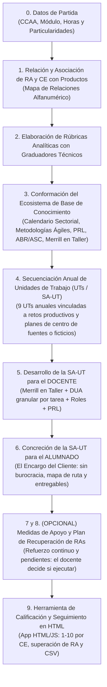

# 🛠️ Guía Oficial: Elaboración de Programaciones y Unidades de Trabajo (SA-UT) en Formación Profesional (FP)

> **Documento Técnico de Referencia de OpenDidactia para Formación Profesional**  
> Basado en la Ley Orgánica 3/2022 (LOOIFP), el Real Decreto 659/2023, la normativa autonómica de desarrollo y la Resolución de 30 de octubre de 2024 de la Dirección General de Formación Profesional de Canarias (*Instrucciones para el diseño de SA-UT competenciales en FP*, Anexo IV de metodologías activas ABR y ASC).

---

## 1. Fundamentos y Especificidad Pedagógica de la FP

A diferencia de las etapas de régimen general (Educación Infantil, Primaria, ESO y Bachillerato), la Formación Profesional se estructura en **Módulos Profesionales**, orientados a la adquisición de **Competencias Profesionales, Personales y Sociales (CPPS)** y competencias para la empleabilidad.

### Comparativa Estructural entre Régimen General y FP:

| Dimensión Curricular | Educación Infantil, Primaria, ESO y Bachillerato | Formación Profesional (Grados D y E) |
| :--- | :--- | :--- |
| **Unidad Curricular** | Área o Materia | **Módulo Profesional** |
| **Unidades de Logro** | Competencias Específicas | **Resultados de Aprendizaje (RA)** |
| **Criterios de Evaluación** | Criterios extensos y descriptivos (requieren *deconstrucción*) | **Criterios de Evaluación (CE)** directos y técnicos (requieren *relación con productos*) |
| **Unidad Didáctica Operativa**| Situación de Aprendizaje (SDA) | **Situación de Aprendizaje - Unidad de Trabajo (SA-UT)** |
| **Entorno de Aprendizaje** | Aula ordinaria / rincones / laboratorios | **Taller, laboratorio técnico, simulador y puesto de trabajo en empresa (FP Dual)** |
| **Metodología Clave** | ABP, Aprendizaje Cooperativo, DUA | **Aprendizaje Basado en Retos (ABR), Aprendizaje-Servicio Colaborativo (ASC) y Merrill en Taller** |
| **Finalidad Terminal** | Perfil de Salida competencial | **Perfil Profesional del Título y Cualificación / Inserción Laboral** |

> 🔗 **Catálogo Oficial de Familias y Títulos:** Para consultar las 26 familias profesionales oficiales, los títulos de Grado Básico, Medio y Superior, Cursos de Especialización y los enlaces a los Reales Decretos en [TodoFP](https://todofp.es), consulten el [**Catálogo Oficial de Familias Profesionales y Títulos de FP (TodoFP - MEFPD)**](catalogo_familias_profesionales_todofp.md).

---

## 2. Protocolo Secuencial de Ingeniería Didáctica en FP (Fases Pedagógicas)

Cualquier docente o agente de IA debe seguir con rigor técnico el siguiente flujo:

### 📋 Regla de Interacción Inter-Fases (Preguntas Claras con Menú Numerado en FP)
Al concluir cada fase técnica o Unidad de Trabajo (UT), el agente **se detiene obligatoriamente** y formula una **pregunta clara con menú numerado** para que el docente elija de forma unívoca indicando solo el número:

* **Al concluir Fase 1, Fase 2 o Fase 4 (Secuenciación Anual de UTs):**
  > *"¿Deseas pasar a la siguiente fase?*  
  > *1. Sí, avanzar a la siguiente fase.*  
  > *2. Realizar ajustes en esta fase."*

* **Al concluir cada SA-UT para el Docente en Taller (Fase 5):**
  > *"¿Cómo deseas proceder con esta unidad ([N.º y Título de la UT])?*  
  > *1. Diseñar la versión para el ALUMNADO (Fase 6: Encargo del Cliente) de esta misma UT.*  
  > *2. Desarrollar la siguiente SA-UT para el DOCENTE (Fase 5 de la siguiente unidad).*  
  > *3. Desarrollar con más detalle la Sesión [indicar n.º de Sesión] (desglose minucioso de tareas de taller, modelado técnico, protocolos PRL y checklists)."*  
  > *(Si se elige la opción 3 o se solicita más detalle de una sesión de taller, el agente la desarrolla exhaustivamente antes de continuar).*

* **Al concluir la SA-UT para el Alumnado (Fase 6):**
  > *"¿Cómo deseas proceder?*  
  > *1. Desarrollar la siguiente SA-UT Docente en taller (Fase 5).*  
  > *2. Pasar a Medidas de Apoyo y Recuperación de RAs (Fases 7 y 8 opcionales)."*

* **Al llegar al Punto de Decisión de Medidas de Apoyo (Fases 7 y 8 - Opcional):**
  > *"¿Deseas diseñar el plan de recuperación de RAs y apoyo en taller (Fases 7 y 8)?*  
  > *1. Sí, elaborar el plan de pendientes con poda curricular y evaluación flexible.*  
  > *2. No, omitir y pasar directamente al Canvas interactivo de calificación (Fase 9).*  
  > *3. No, dar por finalizada la programación del módulo profesional aquí."*

* **Al finalizar el Canvas de Calificación (Fase 9):**
  > *"¿Cómo deseas proceder?*  
  > *1. Generar la aplicación web interactiva HTML/Canvas de calificación FP descargable.*  
  > *2. Concluir la programación del módulo profesional."*

---

## FASE 1: Relación y Asociación de RA y CE con Productos (Mapa de Relaciones)

En FP, dado que la redacción de los Resultados de Aprendizaje (RA) y Criterios de Evaluación (CE) es concisa y de perfil técnico, **no se realiza fragmentación sintáctica (deconstrucción)**, sino una **asociación relacional exhaustiva** entre los elementos curriculares y los productos de aprendizaje.

### Concepto Clave de "Instrumento de Evaluación"
En OpenDidactia, el **Instrumento de Evaluación** es exclusivamente el **PRODUCTO, EVIDENCIA O TAREA TANGIBLE** que el alumnado elabora y entrega en el taller o laboratorio (ej. *Albarán de recepción, Plan de mantenimiento preventivo, Servicio simulado de coctelería, Despiece mecánico 3D, Código fuente de microservicio, Cuadro eléctrico cableado*).

### Protocolo de Asociación:
1. **Inventario Oficial:** Registrar el texto completo del RA y la relación completa de sus Criterios de Evaluación (CE: a, b, c...), junto con los Contenidos básicos, Orientaciones pedagógicas, Objetivos generales (OG) y Competencias (CPPS).
2. **Diseño de Productos Técnicos:** Diseñar 1, 2 o más productos que cubran de forma armónica la totalidad de los Criterios de Evaluación del RA.
3. **Distribución Obligatoria (Regla de Oro):**
   > **Todos los Criterios de Evaluación oficiales de la norma deben quedar vinculados al menos a algún Producto.** No puede quedar ningún CE sin asignar. Si un CE tiene 5 criterios y el Producto 1 evalúa los criterios a, b y c, el Producto 2 debe incorporar obligatoriamente los criterios d y e (pudiendo reforzar alguno de los anteriores).
4. **Codificación Alfanumérica Unificada:**
   Cada fila del Mapa de Relaciones adopta el formato:
   `[RA].[Criterio].[Contenidos básicos].[Objetivos generales].[Competencias].[Producto]`  
   *Ejemplo real:* `1.a).Recepción de materias primas.a).d). Albarán de control de calidad`.

### Matriz del Mapa de Relaciones Curriculares:
| N.º RA | Letra CE | Criterio de Evaluación (Texto Oficial) | Contenidos Básicos Implicados | Objetivos Generales (OG) | Competencias (CPPS) | Instrumento de Evaluación (Producto Numerado) |
| :---: | :---: | :--- | :--- | :---: | :---: | :--- |
| **RA 1** | **a)** | Controla la recepción de géneros según especificaciones | Bloque 1: Materias primas | OG 1, OG 4 | CPPS 2, CPPS 5 | **1.1. Albarán y registro de control térmico** |
| **RA 1** | **b)** | Almacena productos respetando la cadena de frío | Bloque 1: Almacenamiento | OG 1 | CPPS 2 | **1.1. Albarán y registro de control térmico** |
| **RA 1** | **c)** | Clasifica mermas y gestiona su trazabilidad | Bloque 2: Gestión de mermas | OG 3 | CPPS 8 | **1.2. Ficha técnica de mermas y reciclaje** |

> **Pausa de Control Inter-Fase:** Al finalizar la Fase 1, consulta al docente si desea pasar a la siguiente fase o realizar ajustes.

---

## FASE 2: Elaboración de Rúbricas Analíticas con Graduadores Técnicos

Para cada Producto obtenido en la Fase 1, se construye su rúbrica analítica criterial siguiendo la metodología de **graduadores técnicos**.

### Reglas Obligatorias de Elaboración:
1. **Invariabilidad del Verbo Técnico:** El verbo de desempeño profesional fijado en el CE se mantiene idéntico en los 4 niveles de desempeño (PROHIBIDO cambiar el verbo).
2. **Estándar Suficiente/Bien (SU/BI - 5-6):** Reproduce con fidelidad literal la exigencia estándar del Criterio de Evaluación oficial de la norma.
3. **Graduadores Técnicos en Negrita:** Se modulan los niveles destacando en **negrita** los graduadores de:
   - *Calidad y Precisión Técnica:* con precisión milimétrica / con tolerancias admisibles / con desviaciones graves.
   - *Autonomía Profesional:* de forma autónoma / con supervisión puntual / con asistencia constante.
   - *Seguridad y PRL:* cumpliendo escrupulosamente los EPIs y protocolos / con advertencias menores de seguridad.
   - *Eficiencia y Tiempos:* optimizando recursos y tiempos de ciclo / dentro de la jornada estándar.
4. **Erradicación del "No":** En el nivel Insuficiente se describe el fallo técnico, la imprudencia o el defecto; nunca se formula como simple "No lo hace".
5. **Ejemplo Descriptivo de Producto Obligatorio:** En cada nivel de logro se incluye un ejemplo concreto de cómo se manifiesta físicamente el producto entregado.

### Estructura de la Rúbrica Técnica:
| Dimensión Técnica | Insuficiente (1 - 4) | Suficiente / Bien (5 - 6) | Notable (7 - 8) | Sobresaliente (9 - 10) |
| :--- | :--- | :--- | :--- | :--- |
| **Calidad en el Montaje y PRL** | Ejecuta el cableado con **desviaciones críticas**, omitiendo los EPIs obligatorios o generando riesgos de cortocircuito. *Ejemplo:* Faltan punteras, bornes flojos y cables sin canalizar. | Ejecuta el cableado **según plano estándar**, respetando los protocolos básicos de PRL y aislamiento. *Ejemplo:* Cuadro operativo con etiquetado básico y protecciones activas. | Ejecuta el cableado con **elevada precisión y rapidez**, optimizando el trazado de canaletas y la rotulación. *Ejemplo:* Cuadro impecable con esquema unifilar verificado y mediciones exactas. | Ejecuta el cableado con **precisión experta**, proponiendo mejoras de eficiencia energética y verificando tolerancias críticas de forma **totalmente autónoma**. *Ejemplo:* Instalación certificable con informe técnico de puesta en marcha. |

> **Pausa de Control Inter-Fase:** Al finalizar la Fase 2, consulta al docente si desea pasar a la siguiente fase o realizar ajustes.

---

## FASE 3: Ecosistema de Base de Conocimiento para FP

Para que la programación y las UTs estén fuertemente arraigadas en el sector productivo, se consolida una base de conocimiento sectorial compuesta por:

1. **Calendario Profesional y Sectorial:**
   - Ferias internacionales, congresos técnicos, semanas de la innovación, temporadas de producción y eventos empresariales vinculados a la Familia Profesional y al tejido productivo territorial (ej. FOTUR, Salón Gourmets, FITUR, ferias de energías renovables, hackathones tecnológicos).
2. **Cultura Organizacional y Pensamiento Técnico:**
   - Metodologías ágiles de trabajo en equipo (*Scrum*, paneles *Kanban* con tarjetas de trabajo en taller).
   - Simulación de roles corporativos (Jefe de Taller, Oficial de Calidad, Técnico de PRL, Encargado de Compras, Cliente/Usuario).
   - Rutinas de pensamiento crítico para diagnóstico de averías (Diagrama de Ishikawa / Causa-Efecto, 5 Porqués, Protocolo de Triage Técnico).
3. **Metodologías Activas FP Canarias (Resolución de 30 de octubre de 2024 - Anexo IV):**
   - **Aprendizaje Basado en Retos (ABR):** Planteamiento de una "pregunta detonante" o "encargo de cliente real" formulado por una empresa u organismo del entorno.
   - **Aprendizaje-Servicio Colaborativo (ASC):** Proyecto que resuelve una necesidad técnica real de la comunidad educativa o del barrio (ej. reparación de equipos comunitarios, instalación solar en ONG, mantenimiento de vehículos de servicios sociales).
4. **Diseño Instruccional en Taller (5 Principios de David Merrill adaptados):**
   - *1. Reto Técnico Central:* El encargo o problema que el alumnado debe solucionar en taller.
   - *2. Activación:* Repaso de protocolos técnicos y verificación previa de herramientas y máquinas.
   - *3. Demostración con Modelaje Experto y PRL:* El docente demuestra la técnica en el puesto central, explicitando cada movimiento, la ergonomía y los Equipos de Protección Individual (EPIs).
   - *4. Aplicación Guiada en Puesto de Taller:* Práctica del alumnado con lista de control de autochequeo y andamiajes de funciones ejecutivas.
   - *5. Integración y Transferencia Dual:* Conexión directa del aprendizaje adquirido con las tareas que se desempeñarán en la fase de **Formación en Empresa (FP Dual)**.
5. **Objetivos de Centro, Planes y Programas:**
   - Vinculación con los planes del centro (Innovación aplicada, Digitalización, Sostenibilidad, Prevención de Riesgos, Igualdad), tomados de las fuentes facilitadas o asignados para un centro ficticio donde se imparta el ciclo.

---

## Integración Automática de Objetivos y Planes de Centro en FP (Sin Consulta Previa)

El agente **NO realiza ninguna indicación ni consulta previa al usuario al respecto**. La integración de los Objetivos Prioritarios de Centro y Planes/Proyectos de FP (ATECA, Emprendimiento, Innovación Aplicada, etc.) se efectúa de manera completamente automática:

- **Si se encuentran entre las fuentes aportadas:** Se tendrán en cuenta y se integran en la matriz de secuenciación (Fase 4) como ejes técnicos y transversales.
- **Si NO se encuentran entre las fuentes:** Se añadirán de manera aleatoria a partir del [Banco de Objetivos, Planes y Programas por CCAA](banco_objetivos_planes_y_programas_ccaa.md) como si fuese un centro ficticio donde se imparta el ciclo/etapa (asignando objetivos del banco por defecto —empleabilidad y digitalización—, planes institucionales como Plan de PRL/Autoprotección y Plan Digital, y programas de FP como Red ATECA o Aulas de Emprendimiento RAE), garantizando una contextualización profesional completa sin interrumpir el flujo ni formular preguntas al docente.

---

## FASE 4: Secuenciación Anual de Unidades de Trabajo (UTs / SA-UT)

El curso se divide en **9 Unidades de Trabajo (UTs / SA-UT)** articuladas en 3 evaluaciones trimestrales (o el número proporcional a la duración horaria del módulo):
* **1.º Trimestre:** UT 1, UT 2 y UT 3.
* **2.º Trimestre:** UT 4, UT 5 y UT 6.
* **3.º Trimestre:** UT 7, UT 8 y UT 9 (incluyendo preparación para la fase dual).

Para cada UT se concreta:
1. Número y Título profesional motivador (ej. *UT 2: Diagnóstico y resolución de averías en trenes de rodaje*).
2. Temporalización exacta en horas y sesiones de taller.
3. Resultados de Aprendizaje (RA), Criterios de Evaluación (CE) y Contenidos implicados citando el Bloque y número oficial.
4. Vinculación con el Calendario Profesional / Hito sectorial.
5. Reto ABR o proyecto ASC vertebrador.
6. Instrumentos de Evaluación (Productos) y ponderación criterial.
7. Conexión con los Objetivos Prioritarios y Planes de Centro (si se eligió incorporarlos en el control previo).

> **Pausa de Control Inter-Fase:** Al finalizar la Fase 4, consulta al docente si desea pasar a la siguiente fase o realizar ajustes.

---

## FASE 5: Desarrollo de la SA-UT para el DOCENTE

Cada Unidad de Trabajo se desglosa en sesiones de taller/aula técnica (ej. módulo de 6 horas semanales = 18-24 horas por UT).  
Cada sesión debe contener un **mínimo de 2 tareas activas**, detallando minuciosamente:

1. **Título y duración exacta en minutos** (ej. *Tarea 1.1: Triage visual de la placa base (25 min)*).
2. **Descripción detallada con roles:**
   - *Rol del Docente:* Demostrador técnico, garante de la seguridad de taller, facilitador de andamiajes.
   - *Rol del Alumnado:* Operador técnico activo, analista de datos, documentador de calidad.
3. **Cultura Organizacional y Pensamiento Técnico:** Especificar el rol asumido en el equipo (Scrum Master, Responsable de Calidad), tablero Kanban y rutina de diagnóstico aplicada.
4. **Agrupamiento:** Individual en puesto de trabajo, parejas de taller, equipos de proyecto, gran grupo de briefing.
5. **DUA Granular Aplicado en Taller:**
   - *Representación (El Qué):* Fichas técnicas plastificadas en banco de trabajo, videoguías QR con demostraciones paso a paso, pictogramas de advertencia y planos acotados en color.
   - *Acción y Expresión (El Cómo):* Menú de herramientas alternativas para el montaje, listas de verificación de calibración (checklists), simuladores digitales de pre-ensayo antes del corte físico.
   - *Implicación (El Por qué):* Retos auténticos con clientes reales del entorno, rotación equitativa de roles técnicos, retroalimentación formativa inmediata basada en tolerancias de calidad.
6. **Instrumentos de Evaluación / Productos generados** en la tarea y criterios/RA evaluados.
7. **Recursos de Taller, Herramientas, Maquinaria y EPIs obligatorios** (gafas de protección, guantes mecánicos, calzado de seguridad, extractores de humos).

---

## FASE 6: Concreción de la SA-UT para el ALUMNADO ("El Encargo del Cliente")

Para comunicar la UT al alumnado se genera una versión directa, motivadora y libre de códigos normativos:
1. **El Encargo del Cliente / Misión:** Descripción de la necesidad que una empresa ficticia o real del sector ha encomendado al equipo técnico.
2. **El Producto Final a Entregar:** Especificaciones técnicas, plazo de entrega y formato de recepción.
3. **El Mapa de Ruta en 4 Fases de Taller:**
   - *Fase 1: Briefing y Planificación (tablero Kanban y selección de materiales).*
   - *Fase 2: Fabricación / Ensamblaje / Ejecución en Puesto de Trabajo.*
   - *Fase 3: Control de Calidad, Pruebas y Certificación de Seguridad.*
   - *Fase 4: Entrega al Cliente y Retrospectiva de Equipo.*
4. **Criterios de Éxito:** La rúbrica traducida a una lista de control de estándares de calidad profesional comprensible.

> **Consulta de Bifurcación y Detalle Inter-Fase:**  
> Al finalizar la versión docente de la UT (Fase 5 / Fase 4 del flujo maestro), el agente plantea obligatoriamente el menú numerado de cierre:
> *"¿Cómo deseas proceder con esta unidad ([N.º y Título de la UT])?*  
> *1. Diseñar la versión para el ALUMNADO (Fase 6: Encargo del Cliente) de esta misma UT.*  
> *2. Desarrollar la siguiente SA-UT para el DOCENTE (Fase 5 de la siguiente unidad).*  
> *3. Desarrollar con más detalle la Sesión [indicar n.º de Sesión] (desglose minucioso de tareas de taller, modelado técnico, protocolos PRL y checklists)."*

---

## FASES 7 Y 8 (OPCIONAL): Medidas de Apoyo, Refuerzo Continuo y Recuperación de RAs Pendientes

> **Carácter Opcional:** Al llegar a este punto, el agente **DEBE preguntar expresamente al docente**:  
> *"¿Deseas que diseñemos en este momento las medidas de apoyo técnico en taller, refuerzo continuo y planes individualizados de recuperación de RAs pendientes (Fases 7 y 8), o prefieres omitir esta fase y pasar directamente a la herramienta Canvas (Fase 9) o dar por concluida la programación?"*

Si el docente decide abordar estas fases:

### FASE 7: Medidas de Apoyo y Refuerzo Individualizado (Evaluación Continua)
Cuando un alumno no alcanza la calificación positiva en un Resultado de Aprendizaje durante una UT:
1. **Privacidad Estricta:** Uso obligatorio de datos anonimizados (`[ALUMNO_ANONIMIZADO]`).
2. **Enfoque Preventivo y No Segregador:** El refuerzo se implementa de manera **invisible pero constante** durante las sesiones ordinarias de las UTs del siguiente trimestre:
   - Identificación de los CEs específicos deficitarios.
   - Selección de 3-4 aspectos de competencia técnica y metodológica a mejorar.
   - Andamiajes específicos en el puesto de taller (videotutoriales de apoyo asíncronos, checklist de verificación asistida por pareja de taller).
   - Superación: Cuando el alumno demuestra la competencia en el nuevo contexto de taller, la calificación positiva sustituye formalmente a la nota previa.

### FASE 8: Plan de Recuperación de Módulos Pendientes en FP
Para alumnado que promociona con un módulo profesional pendiente del curso anterior:
1. **Focalización Curricular (Poda):** Identificar y seleccionar exclusivamente los **Resultados de Aprendizaje no superados** que constituyen prerrequisitos técnicos esenciales para el ejercicio profesional.
2. **Accesibilidad y Representación DUA:** Disponer repositorios de materiales técnicos asíncronos (videotutoriales, simuladores software, manuales de fabricante con glosarios visuales).
3. **Menú de Evaluación Flexible:** Permitir al estudiante demostrar su competencia mediante diferentes opciones (vídeo demostrativo de ejecución técnica, portafolio de piezas elaboradas, demostración *in situ* en taller ante el docente), separando la destreza técnica de la dificultad de redacción escrita.
4. **Cronograma Escalado:** Entregas e hitos trimestrales coordinados con las sesiones de evaluación del curso en curso, erradicando el examen único final de memoria.
5. **Andamiajes Ejecutivos:** Plantillas estructuradas de cuaderno de taller y listas de verificación.

> **Transición a Fase 9:** Al completar las medidas de apoyo, se avanza directamente a la herramienta interactiva de calificación (Fase 9 / Canvas).

---

## FASE 9: Herramienta Canvas de Calificación y Seguimiento en FP

Se diseña como una aplicación web en un único archivo HTML autocontenido (con Tailwind CSS y JavaScript vanilla) que permite al docente:
1. Calificar numéricamente (1 al 10, sin decimales) cada Criterio de Evaluación según el producto evaluado.
2. Calcular en tiempo real la consecución ponderada de cada Resultado de Aprendizaje (RA) y módulo profesional.
3. Clasificar al alumnado por tipología (Evaluación Ordinaria, Con Necesidades Específicas de Apoyo, Siguiendo Plan de Recuperación de RAs).
4. Crear y asociar Planes de Recuperación donde la nota superada **sobreescribe** la calificación anterior del RA.
5. Exportar todos los registros de evaluación criterial a formato CSV para su archivo oficial.

> **Salida Documental Final:** Consulta al usuario si desea compilar y descargar el archivo final de la herramienta Canvas interactiva (`.html`) y el dossier resumen del módulo.
